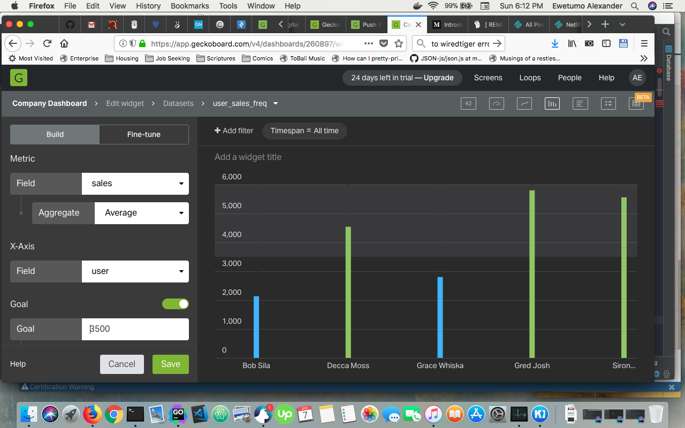
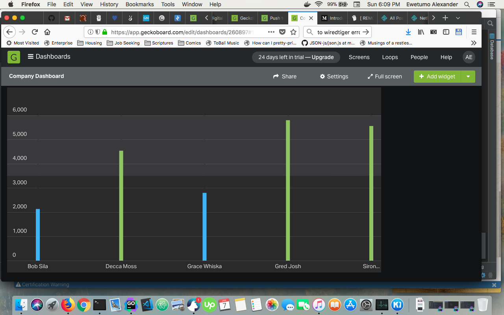

GeckoDataset
----------------
GeckoDataset is a project similar to the [Sql-Dataset](https://github.com/geckoboard/sql-dataset) library, which allows the exporting of collection record into your Geckobaord account's dataset using a combination of processors, pullers and pushers.

It provides a more involved approach to the transformation of incoming data which then gets saved into a dataset of your choosing on your Geckoboard API account. It takes this approach to both allow flexibility and user control of what the data gets transformed into, in both shape and form. 


## Install

```bash
go get -u github.com/influx6/geckodataset/...
```

## Tests

To run integration test `TestJavascriptPushIntegration` in `./cmd/geckoboard-dataset`, you need to provided a test API Authentication key as an environment variable `GECKOBOARD_TEST_KEY`.

```bash
> cd ./cmd/geckoboard-dataset

> GECKOBOARD_TEST_KEY="222efc82e7933138077b1c2554439e15" go test -v -run TestJavascriptPushIntegration
```

*All other tests do not need the environment variable.*

To go further, after running `TestJavascriptPushIntegration`, you can go to your account page on Geckoboard, and using the `Column Chart` widget, like below:
 
  
 
 We can create the metric dashboard like below:
 
  

## Run

GeckoDataset provides a CLI (Command Line) tool called `geckoboard-dataset`:

```bash
> geckoboard-dataset 
Usage: dataset [flags] [command] 

⡿ COMMANDS:
	⠙ push	Push data from a source to the geckoboard Dataset API.


⡿ HELP:
	Run [command] help

⡿ OTHERS:
	Run 'dataset printflags' to print all flags of all commands.

⡿ WARNING:
	Uses internal flag package so flags must precede command name. 
	e.g 'dataset -cmd.flag=4 run'

```

It which exposes a `push` command, which handles the necessary logic to process provided configuration for the retrieval, transformation and update of dataset data.

```bash
> geckoboard-dataset push -config config.toml
```

## Transformers (Procs)

GeckoDataset employs the idea of transformers/processors termed `procs`, which provide functions internally that will take a batch of records from the source and returns appropriate JSON response which will be stored into the user's Geckoboard dataset account.

#### Javascript

This type of transformer is based on the usage of javascript function in a loaded javascript file to transform the provided json of records into the desired shape and form, which then is saved into the datasets account of user.

GeckoDataset uses [Otto](https://github.com/robertkrimen/otto), which is a Go/Golang Javascript runtime, it does not provide support for event loops using functions like `setInterval` and `setTimeout`, but does provide support for majority of the javascript language specification. See project page for more details.

#### Binaries

This type of processor is based on the use of a executable binary, which reads or has a command which will be called that reads from standard input or stdin a payload of json containing a array of records, which will be processed and return appropriate json containing the formated records, which then is written to standard output or stdout.


## Configuration

GeckoDataset supports configuration using either [Yaml](https://github.com/ghodss/yaml) or [TOML](https://github.com/toml-lang/toml) files.

Listed below are different configurations for usage of the geckodataset CLI for sourcing data either through a [MongoDB](htts://mongodb.com) database collection or through a json file or directory, using the YAML format (See [TOML Format](./config/toml.md) for toml version). 

*Be careful in Yaml not to use tabs but spaces, has it gets troublesome*

- Using Javascript Processor with JSON source file


```yaml
interval: 60s
pull_batch: 100
push_batch: 100
api_key: your_api_key
datasets:
 - driver: "json-file"
   op: push
   dataset: "user_sales_freq"
   fields:
    - name: user
      type: string
    - name: scores
      type: number
   conf:
    source: "./fixtures/sales/user_sales.json"
    js:
     target: transformDocument
     main: "./fixtures/transforms/js/user_sales.js"
     libraries: ["./fixtures/transforms/js/support/types.js"]
```

- Using Javascript Processor with JSON source directory


```yaml
interval: 60s
pull_batch: 100
push_batch: 100
api_key: your_api_key
datasets:
 - driver: json-dir
   op: push
   dataset: "user_sales_freq"
   fields:
    - name: user
      type: string
    - name: scores
      type: number
   conf:
    source_dir: "./fixtures/sales"
    js:
     target: transformDocument
     main: "./fixtures/transforms/js/user_sales.js"
     libraries: ["./fixtures/transforms/js/support/types.js"]
```

- Using Javascript Processor with MongoDB source


```yaml
interval: 60s
pull_batch: 100
push_batch: 100
api_key: your_api_key
datasets:
 - driver: mongodb
   op: push
   dataset: user_sales_freq
   fields:
    - name: user
      type: string
    - name: scores
      type: number
   conf:
    dest: user_sales_metrics
    source: user_sales_collection
    db:
     authdb: admin
     db: machines_sales
     user: tobi_mach
     password: "xxxxxxxxxxxx"
     host: db.mongo.com:4500
    js:
     target: transformDocument
     main: "./fixtures/transforms/js/user_sales.js"
     libraries: ["./fixtures/transforms/js/support/types.js"]
```

- Binary Processor with JSON source file

```yaml
interval: 60s
pull_batch: 100
push_batch: 100
api_key: your_api_key
datasets:
 - driver: json-file
   op: push
   dataset: "user_sales_freq"
   fields:
    - name: user
      type: string
    - name: scores
      type: number
   conf:
    source: "./fixtures/sales/user_sales.json"
    binary:
     bin: echo
```

- Using Binary Processor with MongoDB source


```yaml
interval: 60s
pull_batch: 100
push_batch: 100
api_key: your_api_key
datasets:
 - driver: mongodb
   op: push
   dataset: user_sales_freq
   fields:
    - name: user
      type: string
    - name: scores
      type: number
   conf:
    dest: user_sales_metrics
    source: user_sales_collection
    db:
     authdb: admin
     db: machines_sales
     user: tobi_mach
     password: "xxxxxxxxxxxx"
     host: db.mongo.com:4500
    binary:
     bin: echo
```


This configuration used by the project requires details for the following parts:

### Base Configuration

These are the basic configuration values which are specified for the CLI tooling:

#### api_key

This is required to state the Geckobaord's api authentication key.

#### pull_batch and push_batch

These pair of values dictate the total amount of records to be pulled from the source which then will be processed, and also the total amount of records to be pushed to the Geckoboard API from what was pulled and processed. If the `push_batch` value is lower than the `pull_batch`, then the CLI attempts to split the pulled records into giving `push_batch` length, which then all get pushed to the API individually.

*These config parameters is optional*
*Defaults to 500, similar to Geckoboard data push limit.*

#### interval

Allows setting the interval used by the CLI for updating dataset records after processing, because Geckoboard API has a limit on the total amount of records which can be pushed to the API per minute, this values helps to mitigate and reduce the hits against the API for the user's account. 

*These config paramters is optional*
*Defaults to 5s*


### Datasets Configuration

These are the core configuration values which specify how the source data is to be processed and what will be used for the transformation. 

Because Geckodataset supports usage of javascript or binary transformers, these has been explained with respect to each transformer.

*The dataset configurations starts with the `datasets` config key in yaml or the `[[datasets]]` in toml.*

Dataset allows provision of multiple datasets processing instruction which it handles sequentially. The configuration requires the following base parameters:

#### dataset

These paramter is used to set the name of the dataset which would be saved into on the Geckoboard API.

```yaml
dataset: user_sales_frequency
```

#### op

These paramter is used to set the operation to be done with the records either they will be pushed as new records or used to update/replace existing records on the datasets Geckoboard API. It can only ever have two values: `push` or `update`.

```yaml
op: push
```

#### unique_by

These paramter is used to set unique field names which are used when creating new dataset.

```yaml
unique_by: [user, sale]
```

#### delete_by

These paramter is used to set field names which are used when updating old dataset to delete .

```yaml
delete_by: [user]
```

#### fields

These parameter is provides an array of field types which is supported by the Geckoboard API. Incase the dataset is yet to exists, then the initital call of the CLI tool would be to create the dataset with the provided field configuration.

```yaml
fields:
- name: user
  type: string
- name: scores
  type: number
```

Geckodataset supports all Geckoboard API supported types:

```
date
datetime
number
percentage
string
money
```

#### driver

This parameter specify the type of source which will be used the data retrieval. 

Only three options exists for this: `mongodb`, `json-file` and `json-dir`.

##### mongodb

Naturally, `mongodb` represents the the usage of a mongodb database collection as the source of the data, which then requires the addition of the following configuration parameters in the `conf` (in YAML) or `[datasets.conf.db]` (in TOML) section of each dataset.

*Why `conf` ? Because each driver requires specific configuration parameters, any parameters specific to the driver is set in the `conf` section.*


```yaml
conf:
 source: user_sales_collection
 dest: user_sales_metrics
 db:
  authdb: admin
  db: machines_sales
  user: tobi_mach
  password: "xxxxxxxxxxxx"
  host: db.mongo.com:4500
```

The `mongodb` requires the `source` parameter, which dictates the collection to be used with the provided mongodb configuration provided in the `conf.db` section. The `dest` parameter is optional. The `dest` only function is to allow you to have Geckodataset not only push the transformed data to the Geckodataset API for the user's account, but also into another collection within database of the source collection. This allows you to save these processed records for later use.

##### json-file

When dealing with `json-file` as the driver, the configuration parameter is within the `conf` section, which only requires the user provide the `source` parameter which points to the json file which contains a array of json objects which are the records we need to process. 

```yaml
conf:
 source: "./fixtures/sales/user_sales.json"
```

*Only array of objects are acceptable, else it won't work*

The CLI confirms that the file path provided does exists.


##### json-dir

When dealing with `json-dir` as the driver, the configuration parameter is within the `conf` section, which only requires the user provide the `source_dir` parameter which points to the directory containing all the json files all must contain an array of json objects which are the records we need to process. The CLI tool treats the directory has a single source, so if one file fails to process, it will error out and stop all processing.

```yaml
conf:
 source_dir: "./fixtures/sales"
```

The CLI confirms that the directory path provided does exists.

*Only array of objects are acceptable, else it won't work*

#### conf

This parameter as you would have noted from the previous parameters houses the custom paramters of the `driver`.

But it is more than a house for the `driver` configuration paramter, has it also houses the configuration for the processor/transformer being used.

Datasets supports these two transformers:


##### Javascript

This is configured by specifying a `js` parameter in the `conf` section. It specifies the function name with `target`, the main javascript file with `main` and the supporting javascript files with `libraries`.

```yaml
js:
 target: transformDocument
 main: "./fixtures/transforms/js/user_sales.js"
 libraries: ["./fixtures/transforms/js/support/types.js"]
```

These files will be loaded and processed using the [Otto](https://github.com/robertkrimen/otto) javascript vm, which then let's us run against the incoming records.


##### Executable Binaries

GeckoDataset support the usage of a executable binary file, which has being built to read from standard input `stdin` and respond through the standard output files `stdout`. The user gets the flexibility of building the processor with whatever runtime, then have that process the incoming record, responding as desired.

This is configured by specifying a `binary` parameter in the `conf` section. You specify the binary path or name using the `bin` key and if the binary has a special command that caters to the work to be done, you specify this with the `command` configuration key.

```yaml
binary:
 bin: sales_transformer
 command: transform
```

The CLI tool will make the necessary calls by relying on `/bin/sh` with the following binary and command (if provided), where it will feed the incoming records as json strings into the `stdin`, expecting response from the `stdout`. This means the binary must always respond to `stdout` else Geckodataset will await a response till one is recieved.


## Disclaimer

We strongly recommend that the user account you use with the dataset project binaries has the lowest level of permission necessary for retrieving records from the database if possible. 

We also strongly recommend that any storage pusher which saves data into your database has only record writing permission and no removal or updating of existing record permission.

Although the `dataset` project contains no code to perform any adverse effect on your database, but it still reads and saves (if asked to) processed records, hence to ensure no adverse effect, we highly recommend this advice is taking. I accept no responsibility for any adverse changes to your database due to accidentally running users with inappropriate permissions.
